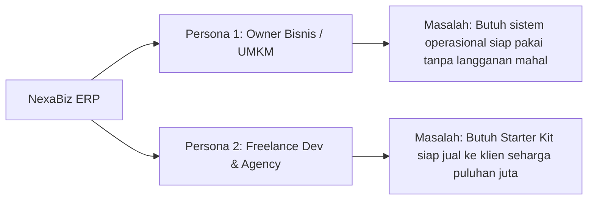
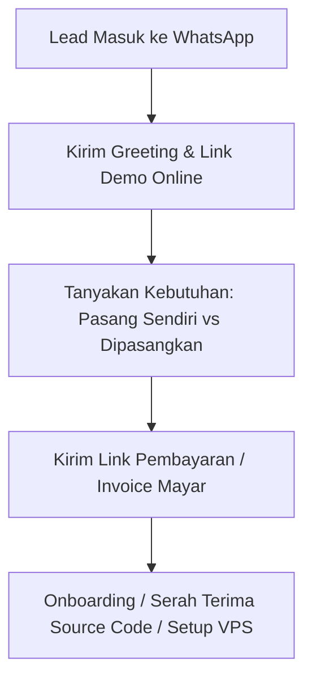

# 📖 NexaBiz ERP — Marketing & Sales Playbook

Dokumen ini adalah panduan lengkap (*playbook*) operasional pemasaran dan penjualan template **NexaBiz ERP** di **LinkedIn**, **Marketplace Produk Digital**, dan **Facebook**.

---

## 📑 Daftar Isi
1. [Positioning Produk & Value Proposition](#1-positioning-produk--value-proposition)
2. [Target Persona Pembeli](#2-target-persona-pembeli)
3. [Paket Penjualan & Strategi Harga (Pricing Tiers)](#3-paket-penjualan--strategi-harga)
4. [Playbook LinkedIn (B2B, Founders, Agencies)](#4-playbook-linkedin)
5. [Playbook Marketplace Produk Digital (Mayar, Lynk, Gumroad)](#5-playbook-marketplace)
6. [Playbook Facebook (Grup Komunitas & Edukasi Organik)](#6-playbook-facebook)
7. [Script Closing & Alur Follow-Up WhatsApp](#7-script-closing--whatsapp)
8. [Jadwal Eksekusi 7 Hari Pertama (Launch Checklist)](#8-jadwal-eksekusi-7-hari-pertama)

---

## 1. Positioning Produk & Value Proposition

### Tagline Utama:
> **"Sistem ERP Bisnis Mandiri (Self-Hosted): Kelola Stok, Produksi, Marketplace, dan Laporan Keuangan Tanpa Biaya Langganan Bulanan."**

### 3 Masalah Besar yang Diselesaikan NexaBiz ERP:
1. **Biaya Langganan Mahal**: Software ERP SaaS di pasaran mengenakan biaya Rp 500.000 – Rp 3.000.000/bulan per user. NexaBiz adalah **sekali beli, milik sendiri selamanya**.
2. **Kekacauan Spreadsheet**: Spreadsheet manual sering rusak, tidak ada validasi stok, dan potongan fee marketplace (8–12%) tidak terhitung akurat di HPP.
3. **Waktu Pengerjaan Software House**: Developer butuh 2–3 bulan untuk membangun sistem ERP dari nol. Dengan template ini, mereka bisa launch dalam hitungan jam.

---

## 2. Target Persona Pembeli



### 👤 Persona 1: Pemilik Bisnis / Brand Owner (Konveksi, Fashion, Retail, Workshop)
- **Pain Point**: Bingung menghitung laba bersih riil setelah potongan marketplace; stok kain/bahan baku sering bocor.
- **Tawaran Terbaik**: Paket Siap Pakai (Anda bantu installkan sampai online di VPS mereka).

### 💻 Persona 2: Freelance Developer & Software House
- **Pain Point**: Klien minta dibuatkan sistem ERP dengan budget terbatas dan deadline ketat.
- **Tawaran Terbaik**: Paket Source Code / Extended Agency License.

---

## 3. Paket Penjualan & Strategi Harga

| Paket | Nama Paket | Harga Rekomendasi | Isi Paket |
|---|---|---|---|
| **Tier 1** | **Starter Source Code** | **Rp 499.000 – Rp 990.000** | Full Source Code (React + FastAPI + Docker), Dokumentasi Instalasi, Lifetime Update. |
| **Tier 2** | **Business Ready + Jasa Setup** *(Paling Laris)* | **Rp 1.990.000 – Rp 3.500.000** | Source Code + **Jasa Anda setup di VPS pembeli** + Pasang Domain/SSL + Ganti Logo Bisnis + 1 Jam Sesi Training via Google Meet. |
| **Tier 3** | **Agency / Extended License** | **Rp 4.900.000 – Rp 9.500.000** | Hak jual ulang ke klien tanpa batas (*white-label*), bebas kustomisasi, konsultasi arsitektur. |

---

## 4. Playbook LinkedIn

LinkedIn sangat efektif untuk menjangkau pengambil keputusan, agency owners, dan tech founders.

### A. Optimasi Profil LinkedIn
- **Headline**: `Building & Providing Self-Hosted ERP Solutions for Small Businesses & Agencies | Python & React`
- **Featured Section**: Sematkan video demo 3 menit dan link pembelian / kontak WhatsApp.

### B. Template Postingan LinkedIn Siap Pakai

#### Post 1: Kisah Studi Kasus & Solusi Bisnis
```text
Banyak pemilik bisnis konveksi dan fashion mengeluhkan hal yang sama:
"Orderan di marketplace ramai, tapi kok waktu tutup buku kasnya nggak sesuai?"

Setelah diaudit, penyebab utamanya:
1. Potongan komisi marketplace (8-12%) tidak dihitung otomatis di HPP produk.
2. Stok bahan baku (kain/benang) dan produk jadi sering mengalami selisih.
3. Software ERP enterprise di pasaran mengenakan biaya langganan bulanan yang memberatkan.

Itulah alasan kami merilis NexaBiz ERP — Sistem ERP Self-Hosted khusus bisnis berkembang:
✅ Sekali beli, milik Anda seutuhnya (100% No Monthly Fee).
✅ Import orderan Shopee & TikTok Shop dengan 1 klik CSV wizard.
✅ Generator Laporan Keuangan resmi (Laba Rugi, Neraca, Buku Besar PDF).
✅ Siap deploy di VPS dalam 5 menit dengan Docker Compose.

Ingin mencoba demo aplikasinya? Tulis "DEMO" di kolom komentar atau hubungi kami via DM! 👇
```

#### Post 2: Khusus Komunitas Developer & Software House
```text
Untuk teman-teman Software House & Freelance Developer:

Berapa lama waktu yang tim Anda habiskan untuk membangun modul ERP dari nol (COA akuntansi, inventaris multi-varian, BOM produksi, dan sistem auth)?
Rata-rata butuh 200+ jam kerja.

Kini Anda bisa menghemat waktu tersebut dengan NexaBiz ERP Template:
⚡ Modern Stack: FastAPI (Python 3.11) + React 19 + MongoDB.
⚡ Production Security: Brute-force lockout, password hardening, user roles.
⚡ 30+ Automated Unit Tests passing 100%.
⚡ Full Source Code & Docker Ready.

Gunakan template ini sebagai pondasi project klien Anda dan charge mereka puluhan juta rupiah.

Link dokumentasi dan demo ada di kolom komentar! 🚀
```

### C. Script Direct Message (DM) Outreach LinkedIn ke Founder
```text
"Halo Pak/Bu [Nama], salam kenal!

Saya melihat perkembangan bisnis [Nama Perusahaan] yang sangat luar biasa di bidang [Fashion/Retail/Konveksi].

Saya ingin berbagi solusi: jika saat ini tim operasional Bapak/Ibu masih mencatat stok dan rekap pesanan marketplace secara manual di spreadsheet, kami mengembangkan sistem NexaBiz ERP yang sifatnya Self-Hosted (sekali beli, tanpa biaya langganan bulanan).

Jika berkenan, izinkan saya mengirimkan video demo 3 menit bagaimana sistem ini bekerja untuk bisnis Bapak/Ibu. Terima kasih!"
```

---

## 5. Playbook Marketplace Produk Digital

### A. Rekomendasi Platform Checkout:
- **Indonesia**: [Mayar.id](https://mayar.id) atau [Lynk.id](https://lynk.id) (Mendukung QRIS, BCA, Mandiri, BRI, Virtual Account, E-Wallet otomatis).
- **Freelance Platform**: [Fastwork.id](https://fastwork.id) (Buka jasa *"Setup Sistem ERP Bisnis Mandiri"*).
- **Internasional**: [Gumroad.com](https://gumroad.com) ($49 – $149).

### B. Deskripsi Listing Produk di Marketplace (*Copywriting*)
```text
🔥 NEXABIZ ERP — Full-Stack Self-Hosted ERP Template (React + FastAPI + Docker)
Solusi ERP All-in-One: Penjualan, Stok, Produksi, Marketplace, dan Akuntansi Tanpa Biaya Bulanan!

Apakah Anda ingin memiliki sistem ERP sendiri untuk bisnis Anda, atau ingin starter kit siap jual ke klien software house Anda seharga puluhan juta? NexaBiz ERP adalah jawabannya!

FITUR LENGKAP YANG ANDA DAPATKAN:
📦 Master Produk, Varian Warna/Ukuran, & Notifikasi Stok Menipis.
🧵 Manajemen Bahan Baku (Raw Materials) & BOM Resep Produksi.
🛒 Universal Import Wizard: Import ribuan order Shopee/TikTok/Excel dengan Live Preview.
⚖️ Finance Suite & Bagan Akun (COA): Saldo Awal, Neraca, Neraca Saldo, Buku Besar.
📄 Export Dokumen Resmi: Laporan Laba Rugi PDF formal & Export Excel/CSV lengkap.
🔐 Keamanan Produksi: Anti Brute-Force lockout, Manajemen Hak Akses Staf (RBAC).
🐳 Docker Ready: 1 perintah jalan di VPS atau Komputer Windows.

YANG ANDA DAPATKAN SETELAH PEMBELIAN:
1. Full Source Code Frontend (React 19 + Tailwind) & Backend (FastAPI Python).
2. Dockerfile & docker-compose.yml siap deploy.
3. Panduan Instalasi Langkah-demi-Langkah (BUYER_GUIDE.md & FAQ.md).
4. 30 Test Suites Otomatis.
5. Lifetime Update & Lisensi Komersial.
```

---

## 6. Playbook Facebook (Grup Komunitas & Edukasi Organik)

### A. Grup Target di Facebook:
- *Komunitas Pengusaha Konveksi & Sablon Indonesia*
- *Komunitas Seller Shopee & TikTok Shop Indonesia*
- *Komunitas Bisnis Fashion & Distro Lokal*
- *Komunitas Programmer Python / React Indonesia*
- *Komunitas UMKM Naik Kelas*

### B. Taktik "Lead Magnet" (Bagi Gratisan -> Konversi Software)
1. **Posting Nilai Edukasi**: Bagikan file gratis *"Template Excel Hitung HPP & Simulasi Profit Marketplace"*.
2. **Call To Action**: Di dalam Excel tersebut, beri tulisan:
   > *"Ingin perhitungan HPP, pemotongan stok otomatis saat jualan di Shopee, dan cetak Laba Rugi berjalan otomatis di web bisnis Anda sendiri? Kunjungi NexaBiz ERP."*

### C. Template Postingan Facebook Organik
```text
Sharing pengalaman audit stok konveksi kemarin...

Banyak yang ngira untung bersihnya 30%, pas dihitung ulang ternyata cuma 8%. Kenapa?
Karena biaya reject sablon, packing polymailer, dan potongan fee marketplace nggak kecatat detail di sistem harian.

Buat temen-temen yang mau sistem pencatatan otomatis yang nggak perlu bayar langganan bulanan, kami buatkan software "NexaBiz ERP" (Bisa diinstall di komputer toko atau server sendiri).

Fitur unggulan:
- Sekali klik import ratusan order Shopee/TikTok dari file CSV.
- Stok bahan otomatis kepotong waktu ada pesanan masuk.
- Cetak Laporan Laba Rugi resmi PDF buat bank/pajak.

Yang mau coba demo webnya, silakan komen "MAU" ya, nanti saya kirim link demonya via inbox. Gratis coba dulu! 🙏
```

---

## 7. Script Closing & Alur Follow-Up WhatsApp

Saat calon pembeli klik link WhatsApp dari LinkedIn, Facebook, atau Marketplace:



### Script 1: Menyambut Calon Pembeli & Memberikan Demo
```text
"Halo Kak [Nama], terima kasih sudah menghubungi NexaBiz ERP! 👋

NexaBiz adalah software ERP Self-Hosted (sekali bayar, source code milik Kakak seutuhnya, tanpa biaya bulanan).

Kakak bisa langsung mencoba demo interaktifnya di sini:
🌐 Link Demo: [https://demo-nexabiz.com atau Link Video Loom]
👤 Akun Login:
- Email: owner@example.com
- Password: password123

Boleh tahu, sistem ini rencananya akan digunakan untuk bisnis Kakak sendiri (bidang apa kak?), atau untuk project klien software house?"
```

### Script 2: Menawarkan Paket Setup Siap Pakai (Upselling)
```text
"Baik Kak! Kami menyediakan 2 opsi:

1. Paket Source Code (Rp 499.000): Kakak mendapatkan source code lengkap dan panduan instalasi mandiri.
2. Paket Bisnis Siap Pakai (Rp 1.990.000): Kakak tinggal terima beres, kami bantu pasangkan langsung sampai online di VPS/domain Kakak + ganti logo bisnis + 1 jam sesi training via Zoom.

Kira-kira Kakak lebih nyaman opsi yang mana?"
```

---

## 8. Jadwal Eksekusi 7 Hari Pertama (Launch Checklist)

- [ ] **Hari 1**: Buat akun merchant di **Mayar.id** atau **Lynk.id**, hubungkan rekening bank Anda, dan upload produk NexaBiz ERP.
- [ ] **Hari 2**: Ambil 6 screenshot terbaik (Dashboard, Import Wizard, Finance Suite, BOM Produksi, Laporan PDF) dan rekam video demo layar 3 menit.
- [ ] **Hari 3**: Buat postingan pengenalan produk di **LinkedIn** dan pasang link demo di profil.
- [ ] **Hari 4**: Bergabung ke 5-10 grup Facebook pengusaha konveksi/fashion dan bagikan studi kasus pencatatan stok.
- [ ] **Hari 5**: Lakukan direct message (DM) outreach personal di LinkedIn ke 15 owner agency/software house.
- [ ] **Hari 6**: Berikan penawaran khusus *"Early Bird Diskon 50% untuk 5 Pembeli Pertama"*.
- [ ] **Hari 7**: Follow-up semua kontak WhatsApp yang telah mencoba demo dan lakukan closing transaksi.

---

*Playbook ini siap dieksekusi untuk menghasilkan penjualan pertama Anda!* 🚀
